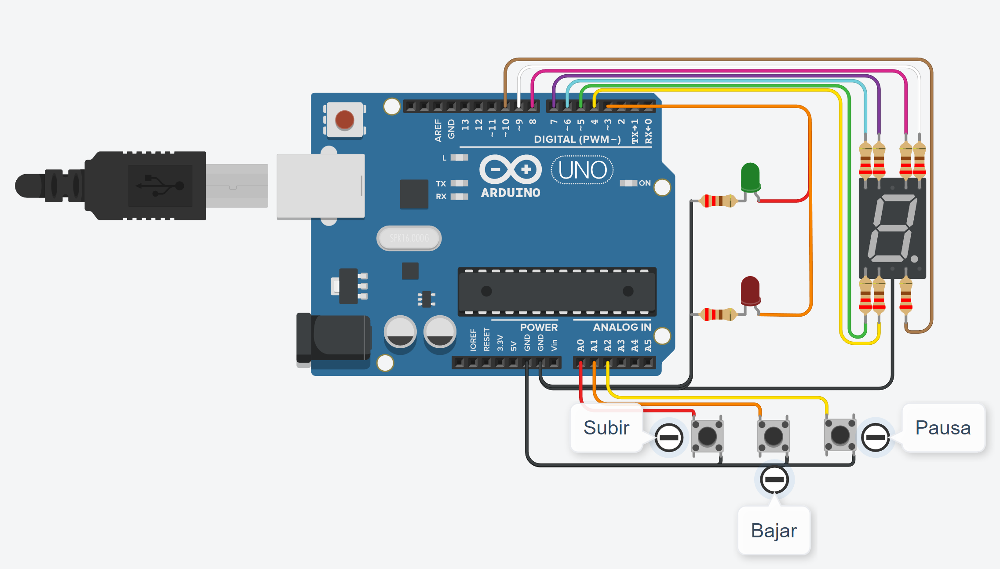

# Primer Parcial SPD 1J.
Lautaro Testa.

### Descripción:
Modelo de montacargas funcional que permite subir y bajar pisos con 2 pulsadores independientes. Ademas, cuenta con un boton de emergencia que detiene el montacargas en el caso de que existan inconvenientes en el trayecto.
### Componentes:
* 1 Arduino R3.
* 1 Display de 7 segmentos.
* 2 Leds (rojo y verde).
* 3 Pulsadores.
* 9 Resistencias.
---
#### Asignación de pines del Arduino a cada componente:
```C++
#define Led_Verde 2
#define Led_Rojo 3
#define Led_A 8
#define Led_B 9
#define Led_C 10
#define Led_D 4
#define Led_E 5
#define Led_F 7
#define Led_G 6
#define PULSADOR_SUBIR A0
#define PULSADOR_BAJAR A1
#define PULSADOR_PAUSA A2
```
---
la variable "contador" es una variable global, ya que se utiliza durante todo el codigo.
```C++
int contador = 0; 
```
---
#### Configuración de entradas y salidas digitales: 
```C++
pinMode(2, OUTPUT);
pinMode(3, OUTPUT);
pinMode(4, OUTPUT);
pinMode(5, OUTPUT);
pinMode(6, OUTPUT);
pinMode(7, OUTPUT);
pinMode(8, OUTPUT);
pinMode(9, OUTPUT);
pinMode(10, OUTPUT);
pinMode(A0, INPUT_PULLUP);
pinMode(A1, INPUT_PULLUP);
pinMode(A2, INPUT_PULLUP);
Serial.begin(9600);
```
---
### Desempeño del programa:
Estas variables se igualan a la función "digitalRead()" para leer el valor de los pines asignados cada vez que se las llama.
```C++
int presionosubir = digitalRead(A0);
int presionobajar = digitalRead(A1);
int presionopausa = digitalRead(A2);
```
En el caso de que la variable "presionosubir" lea como valor un 0, el montacargas subira un piso. Ejemplo:
```C++
if (presionosubir == LOW)
  {
    EncenderyApagarLeds (2,3,1,0);
    switch(contador)
    {  case 0:
        delay(250);
        Serial.println(contador);
      	EncenderyApagarDisplay(4,5,0,7,8,9,10);
        contador++;
        break; }
  }    
```

Por otro lado, si la variable "presionobajar" lee como valor un 0, entonces el montacargas bajara un piso. Ejemplo:
```C++
else if (presionobajar == LOW)
   { 
     EncenderyApagarLeds (2,3,1,0);
     switch(contador)
     {  case 1: 
         delay(250);
         Serial.println(contador);
         EncenderyApagarDisplay(0,0,0,0,0,9,10); 
         contador--;
         break; }
   }    
```
Pero si la variable "presionopausa" lee como valor un 0, el montacargas se dentendra, mostrara un mensaje advirtiendo lo sucedido y el piso en el que se detuvo. Ejemplo:
```C++
else if (presionopausa == LOW)
    {
      EncenderyApagarLeds (2,3,0,1);
      switch(contador)
      { case 0: //0
         delay(250);
         EncenderyApagarDisplay(4,5,0,7,8,9,10);
         Serial.print("Montagargas en pausa, piso: ");
         Serial.println(contador);
         break;}
    }
```
---
### Explicación de las funciones:
La función "EncenderyApagarDisplay" le asigna estados a todos los leds del display de 7 segmentos, de manera que cuando se la llame se pueda elegir que leds del display encender y cuales apagar.
``` C++
void EncenderyApagarDisplay (int A, int B, int C, int D, int E, int F, int G)
{
  digitalWrite(A, HIGH);
  digitalWrite(B, HIGH);
  digitalWrite(C, HIGH);
  digitalWrite(D, HIGH);
  digitalWrite(E, HIGH);
  digitalWrite(F, HIGH);
  digitalWrite(G, HIGH);
  delay(3000);
  digitalWrite(A, LOW);
  digitalWrite(B, LOW);
  digitalWrite(C, LOW);
  digitalWrite(D, LOW);
  digitalWrite(E, LOW);
  digitalWrite(F, LOW);
  digitalWrite(G, LOW);
}
```

La función "EncenderyApagarLeds" le asigna estados al led verde y al led rojo, de manera que cuando se la llame se pueda elegir que led encender y cual apagar.
```C++
void EncenderyApagarLeds (int led_verde, int led_rojo, int estado, int estado_dos)
{
  digitalWrite(led_verde, estado);
  digitalWrite(led_rojo, estado_dos);
  digitalWrite(led_verde, estado);
  digitalWrite(led_rojo, estado_dos);
}
```
